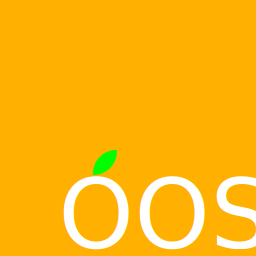

语言Language: [简体中文](#OurOpenSource_zh_CN) | [English](#OurOpenSource_en_EN)

    

    

---

# OurOpenSource_zh_CN

一个强大的库。*（自我疑问？*

## 库列表

都可以从Nuget官方下载。

<table>
    <tr align="center">
        <th colspan="5">
用于C&#35;的OurOpenSource
</th>
    </tr>
    <tr align="center">
        <th rowspan="1">
库
</th>
        <th rowspan="1">
命名空间
</th>
        <th rowspan="1">
功能
</th>
        <th rowspan="1">
备注
</th>
        <th rowspan="1">
额外引用
</th>
    </tr>
    <tr align="left">
        <td rowspan="2">
OurOpenSource
</td>
        <td rowspan="1">
OurOpenSource
</td>
        <td rowspan="1">

</td>
        <td rowspan="1">

</td>
        <td rowspan="2">
/
</td>
    </tr>
    <tr align="left">
        <td rowspan="1">
OurOpenSource.Utility
</td>
        <td rowspan="1">
一堆杂货。
</td>
        <td rowspan="1">

</td>
    </tr>
    <tr align="left">
        <td rowspan="1">
OurOpenSource.Data
</td>
        <td rowspan="1">
OurOpenSource.Data
</td>
        <td rowspan="1">
一些数据类型。
</td>
        <td rowspan="1">

</td>
        <td rowspan="1">
/
</td>
    </tr>
    <tr align="left">
        <td rowspan="2">
OurOpenSource.Net
</td>
        <td rowspan="1">
OurOpenSource.Net
</td>
        <td rowspan="1">
一个方便的网络库。
</td>
        <td rowspan="1">

</td>
        <td rowspan="2">
            

                <a href="https://anglesharp.github.io/">AngleSharp</a>[<a href="https://github.com/AngleSharp/AngleSharp/blob/devel/LICENSE">MIT</a>]
            

        </td>
    </tr>
    <tr align="left">
        <td rowspan="1">
OurOpenSource.Net.Mail
</td>
        <td rowspan="1">
发邮件的。
</td>
        <td rowspan="1">

</td>
    </tr>
    <tr align="left">
        <td rowspan="3">
OurOpenSource.Security
</td>
        <td rowspan="1">
OurOpenSource.Security
</td>
        <td rowspan="1">
一个方便的安全库。
</td>
        <td rowspan="1">

</td>
        <td rowspan="3">
            

                <a href="https://www.newtonsoft.com/json">Newtonsoft.Json</a>[<a href="https://github.com/JamesNK/Newtonsoft.Json/blob/master/LICENSE.md">MIT</a>]; 
                <a href="https://www.bouncycastle.org/">BouncyCastle</a>[<a href="https://www.bouncycastle.org/csharp/licence.html">Licence</a>(<i><b>类似</b>于<a href="https://mit-license.org/">MIT</a></i>)](<a href="https://github.com/bcgit/bc-csharp">BouncyCastle.NetCoreSdk</a>); 
                <a href="https://github.com/stoneson/Vive.Crypto">Vive.Crypto</a>[<a href="https://github.com/stoneson/Vive.Crypto/blob/master/LICENSE">MIT</a>]
            

        </td>
    </tr>
    <tr align="left">
        <td rowspan="1">
OurOpenSource.Security.Cryptography
</td>
        <td rowspan="1">
加密算法。
</td>
        <td rowspan="1">

</td>
    </tr>
    <tr align="left">
        <td rowspan="1">
OurOpenSource.Security.UniqueDevice
</td>
        <td rowspan="1">
用于获取设备识别信息。
</td>
        <td rowspan="1">

</td>
    </tr>
</table>

**VisualStudio版本是2022，`OurOpenSoure`库用的是`.NET Standrad 2.0`，其余用的都是`.NET Core 3.1`。**

***引用部分的许可证于2022年7月19日更新。如有变更，请联系维护者进行修正。***

### 不在本Git仓库的OurOpenSource库

* [OurOpenSource.Data.EasyMark](https://github.com/Orange23333/OurOpenSource.Data.EasyMark)

* [OurOpenSource.TextUnit.HelpViewer](https://github.com/Orange23333/OurOpenSource.TextUnit.HelpViewer)

---

---

---

# OurOpenSource_en_EN

A powerful library.

## Library List

All of below could donwload form nuget.

<table>
    <tr align="center">
        <th colspan="5">
OurOpenSource of CSharp
</th>
    </tr>
    <tr align="center">
        <th rowspan="1">
Libraries
</th>
        <th rowspan="1">
Namespaces
</th>
        <th rowspan="1">
Functions
</th>
        <th rowspan="1">
Remarks
</th>
        <th rowspan="1">
Additional References
</th>
    </tr>
    <tr align="left">
        <td rowspan="2">
OurOpenSource
</td>
        <td rowspan="1">
OurOpenSource
</td>
        <td rowspan="1">

</td>
        <td rowspan="1">

</td>
        <td rowspan="2">
/
</td>
    </tr>
    <tr align="left">
        <td rowspan="1">
OurOpenSource.Utility
</td>
        <td rowspan="1">
Blobs.
</td>
        <td rowspan="1">

</td>
    </tr>
    <tr align="left">
        <td rowspan="1">
OurOpenSource.Data
</td>
        <td rowspan="1">
OurOpenSource.Data
</td>
        <td rowspan="1">
Some data types.
</td>
        <td rowspan="1">

</td>
        <td rowspan="1">
/
</td>
    </tr>
    <tr align="left">
        <td rowspan="2">
OurOpenSource.Net
</td>
        <td rowspan="1">
OurOpenSource.Net
</td>
        <td rowspan="1">
A user-friendly network library.
</td>
        <td rowspan="1">

</td>
        <td rowspan="2">
            

                <a href="https://anglesharp.github.io/">AngleSharp</a>[<a href="https://github.com/AngleSharp/AngleSharp/blob/devel/LICENSE">MIT</a>]
            

        </td>
    </tr>
    <tr align="left">
        <td rowspan="1">
OurOpenSource.Net.Mail
</td>
        <td rowspan="1">
Send email.
</td>
        <td rowspan="1">

</td>
    </tr>
    <tr align="left">
        <td rowspan="3">
OurOpenSource.Security
</td>
        <td rowspan="1">
OurOpenSource.Security
</td>
        <td rowspan="1">
A user-friendly security.
</td>
        <td rowspan="1">

</td>
        <td rowspan="3">
            

                <a href="https://www.newtonsoft.com/json">Newtonsoft.Json</a>[<a href="https://github.com/JamesNK/Newtonsoft.Json/blob/master/LICENSE.md">MIT</a>]; 
                <a href="https://www.bouncycastle.org/">BouncyCastle</a>[<a href="https://www.bouncycastle.org/csharp/licence.html">Licence</a>(<i><b>similar</b> to <a href="https://mit-license.org/">MIT</a></i>)](<a href="https://github.com/bcgit/bc-csharp">BouncyCastle.NetCoreSdk</a>); 
                <a href="https://github.com/stoneson/Vive.Crypto">Vive.Crypto</a>[<a href="https://github.com/stoneson/Vive.Crypto/blob/master/LICENSE">MIT</a>]
            

        </td>
    </tr>
    <tr align="left">
        <td rowspan="1">
OurOpenSource.Security.Cryptography
</td>
        <td rowspan="1">
Cryptography.
</td>
        <td rowspan="1">

</td>
    </tr>
    <tr align="left">
        <td rowspan="1">
OurOpenSource.Security.UniqueDevice
</td>
        <td rowspan="1">
For getting device identification information.
</td>
        <td rowspan="1">

</td>
    </tr>
</table>

**VisualStudio version is2022, Library `OurOpenSoure` is using `.NET Standrad 2.0`, the rest are using `.NET Core 3.1`.**

***Licenses of references updated on 19th July, 2022. If one of them has been changed, please contact the maintainer to correct.***

### Some OurOpenSource Library not in this Git Depository

* [OurOpenSource.Data.EasyMark](https://github.com/Orange23333/OurOpenSource.Data.EasyMark)

* [OurOpenSource.TextUnit.HelpViewer](https://github.com/Orange23333/OurOpenSource.TextUnit.HelpViewer)